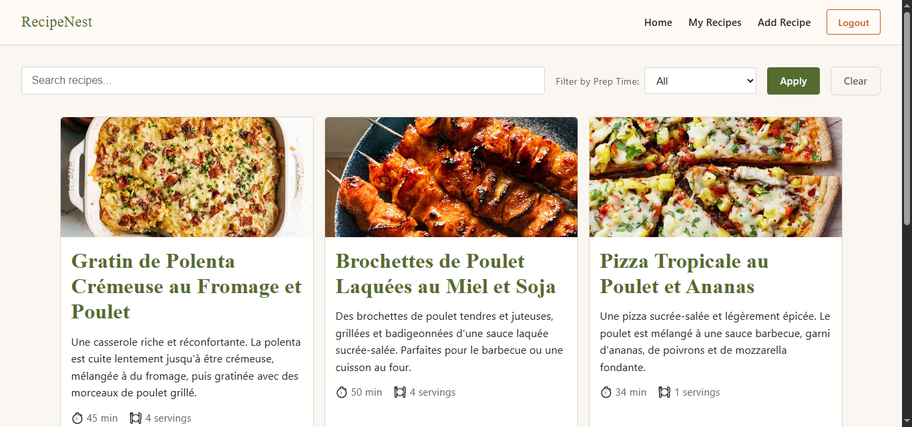
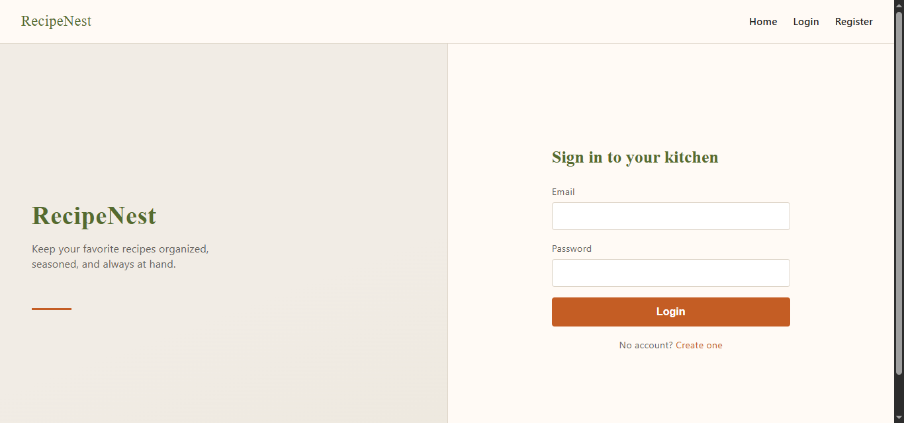
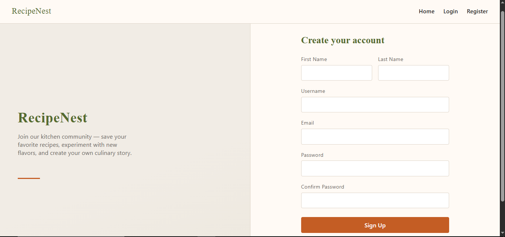
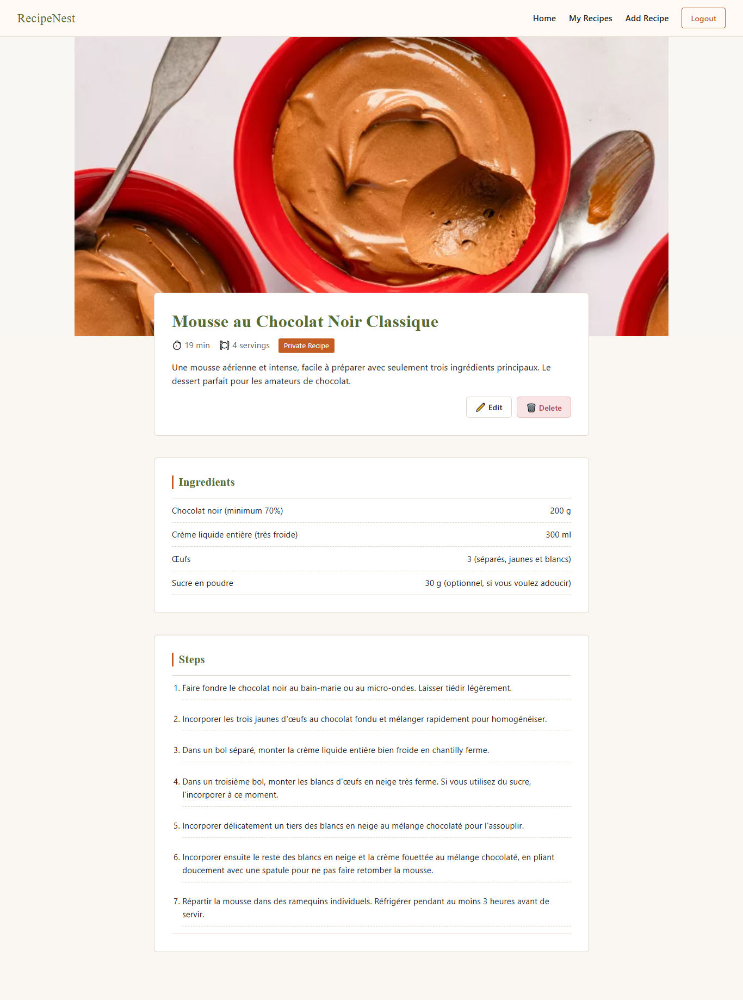
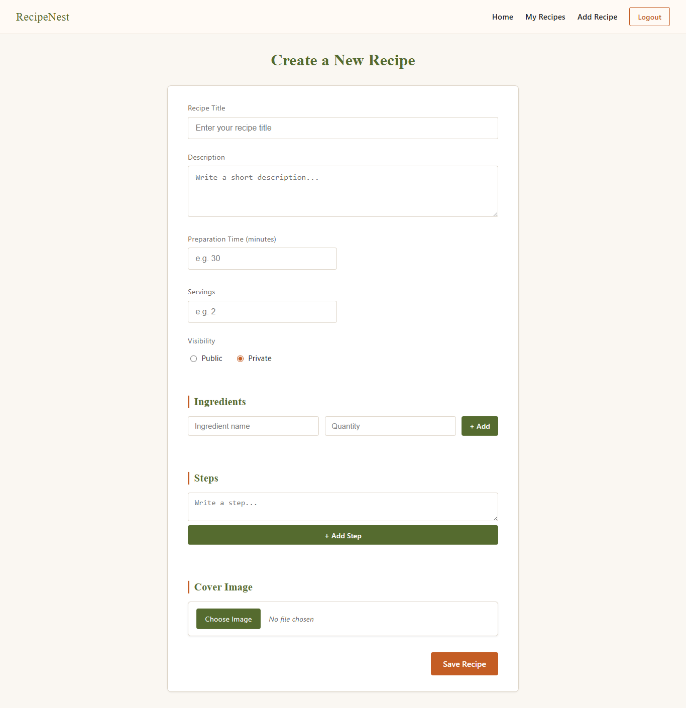

# 🍳 RecipeNest - Recipe Management Application

**RecipeNest** est une application web full-stack de gestion de recettes qui permet aux utilisateurs de créer, partager, rechercher et organiser leurs recettes de cuisine préférées.

---

## 📸 Screenshots

### Page d'accueil

*Parcourez toutes les recettes publiques avec recherche et filtrage par temps de préparation*

### Connexion

*Authentification sécurisée avec JWT*

### Inscription

*Créez votre compte pour commencer à partager vos recettes*

### Détails d'une recette

*Consultez les ingrédients, étapes et informations complètes d'une recette*

### Création de recette

*Formulaire intuitif avec upload d'image et gestion dynamique des ingrédients/étapes*

---

## 🚀 Fonctionnalités

### Authentification & Sécurité
- ✅ Inscription et connexion utilisateur
- ✅ Authentification JWT avec tokens sécurisés
- ✅ Hachage des mots de passe avec bcrypt
- ✅ Routes protégées (middleware d'authentification)
- ✅ Persistance de session avec localStorage

### Gestion des recettes
- ✅ Créer une recette avec image, ingrédients et étapes
- ✅ Modifier ses propres recettes
- ✅ Supprimer ses propres recettes
- ✅ Marquer une recette comme publique ou privée
- ✅ Upload d'images avec Multer
- ✅ Gestion dynamique des ingrédients (ajout/suppression)
- ✅ Gestion dynamique des étapes de préparation

### Navigation & Recherche
- ✅ Page d'accueil avec toutes les recettes publiques
- ✅ Recherche de recettes par titre ou description
- ✅ Filtrage par temps de préparation
- ✅ Page "Mes recettes" pour gérer ses créations
- ✅ Vue détaillée de chaque recette

### Interface utilisateur
- ✅ Design responsive et moderne
- ✅ Navigation conditionnelle (connecté/déconnecté)
- ✅ Prévisualisation d'image avant upload
- ✅ Messages d'erreur et de succès clairs
- ✅ États de chargement (spinners)

---

## 🛠️ Technologies utilisées

### Backend
- **Node.js** - Runtime JavaScript
- **Express.js** - Framework web
- **MongoDB** - Base de données NoSQL
- **Mongoose** - ODM pour MongoDB
- **JWT** - Authentification par tokens
- **bcryptjs** - Hachage de mots de passe
- **Multer** - Upload de fichiers
- **CORS** - Gestion des requêtes cross-origin

### Frontend
- **React 19** - Bibliothèque UI
- **React Router DOM** - Navigation
- **Context API** - Gestion d'état globale
- **Axios** - Requêtes HTTP
- **Vite** - Build tool moderne
- **CSS3** - Styling personnalisé

---

## 📦 Installation

### Prérequis
- Node.js (v16+)
- MongoDB (local ou MongoDB Atlas)
- npm ou yarn

### Backend

```bash
# Naviguer dans le dossier backend
cd backend

# Installer les dépendances
npm install

# Créer un fichier .env
touch .env
```

Contenu du fichier `.env` :
```env
PORT=3000
DB_URI=mongodb://localhost:27017/recipe-management
JWT_SECRET=votre_secret_jwt_super_securise
```

```bash
# Démarrer le serveur
npm run dev
```

Le backend sera accessible sur `http://localhost:3000`

### Frontend

```bash
# Naviguer dans le dossier frontend
cd frontend

# Installer les dépendances
npm install

# Démarrer l'application
npm run dev
```

Le frontend sera accessible sur `http://localhost:5173`

---

## 📁 Structure du projet

```
recipe-management/
├── backend/
│   ├── controllers/
│   │   ├── recipeController.js
│   │   └── userController.js
│   ├── models/
│   │   ├── Recipe.js
│   │   └── User.js
│   ├── routes/
│   │   ├── recipeRoutes.js
│   │   └── userRoutes.js
│   ├── middlewares/
│   │   ├── authMiddleware.js
│   │   └── optionalAuth.js
│   ├── config/
│   │   └── multerConfig.js
│   ├── uploads/
│   │   └── images/
│   ├── server.js
│   └── package.json
│
├── frontend/
│   ├── src/
│   │   ├── components/
│   │   │   ├── Navbar.jsx
│   │   │   ├── ProtectedRoute.jsx
│   │   │   └── Spinner.jsx
│   │   ├── pages/
│   │   │   ├── HomePage.jsx
│   │   │   ├── Login.jsx
│   │   │   ├── Register.jsx
│   │   │   ├── RecipeDetails.jsx
│   │   │   ├── RecipeForm.jsx
│   │   │   └── MyRecipes.jsx
│   │   ├── context/
│   │   │   └── AuthContext.jsx
│   │   ├── assets/
│   │   │   └── styles/
│   │   ├── App.jsx
│   │   ├── main.jsx
│   │   └── index.css
│   └── package.json
│
└── screens/
    └── [screenshots]
```

---

## 🎓 Compétences développées

### Architecture & Conception
- Architecture Client-Serveur
- API RESTful avec Express
- Modélisation de données complexes (relations one-to-many)
- Principes MVC appliqués au backend
- Séparation des responsabilités (controllers, models, routes)

### Gestion de données
- Schémas MongoDB avec Mongoose
- Relations entre collections (User → Recipes)
- Validation de données côté serveur
- Requêtes MongoDB avancées (recherche, filtrage)
- Gestion de tableaux imbriqués (ingredients, steps)

### Sécurité & Authentification
- Authentification JWT
- Hachage de mots de passe avec bcrypt
- Protection de routes avec middlewares
- Gestion de tokens côté client
- Autorisation (vérification de propriété des ressources)

### Upload de fichiers
- Configuration de Multer
- Gestion de fichiers binaires (images)
- Validation de types MIME
- Stockage local de fichiers
- Preview d'images côté client avec URL.createObjectURL()

### Frontend React
- Gestion d'état avec Context API
- React Router avec routes protégées
- Formulaires contrôlés et non contrôlés
- Gestion d'état complexe (listes dynamiques)
- Upload de fichiers avec FormData
- Communication asynchrone avec axios

### Best Practices
- Code commenté et maintenable
- Gestion d'erreurs (try/catch, messages clairs)
- Versioning avec Git (commits réguliers)
- Variables d'environnement (.env)
- États de chargement (UX)
- Validation côté client et serveur

---

## 🚧 Améliorations futures

- [ ] Migration vers Cloudinary pour le stockage d'images en production
- [ ] Système de favoris/likes
- [ ] Commentaires sur les recettes
- [ ] Notation des recettes (étoiles)
- [ ] Catégories de recettes (dessert, plat principal, etc.)
- [ ] Tags personnalisés
- [ ] Export de recettes en PDF
- [ ] Mode sombre
- [ ] Tests unitaires et d'intégration
- [ ] Déploiement sur Render/Railway

---

## 📄 Licence

Ce projet est un projet d'apprentissage personnel. Libre d'utilisation à des fins éducatives.

**⭐ Si ce projet vous a été utile, n'hésitez pas à lui donner une étoile sur GitHub !**
